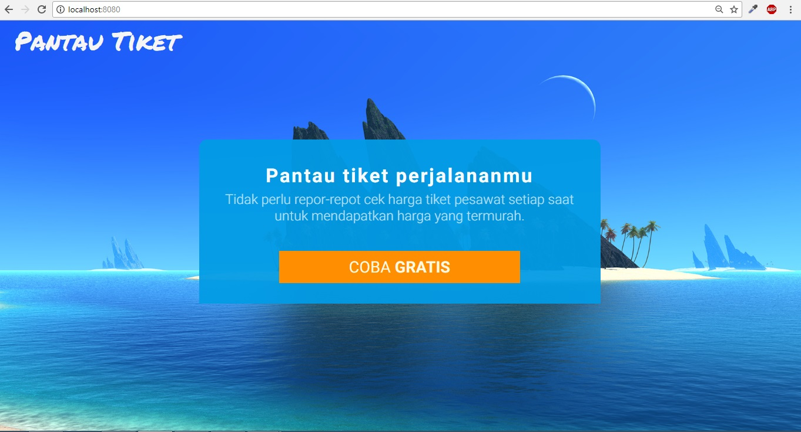

# Pantau Tiket

Aplikasi web ini bertujuan untuk memantau harga tiket pesawat secara otomatis dan mengirimkan informasi ketika ada harga tiket yang lebih rendah dibandingkan dengan harga yang dipantau oleh pengguna. Jasa/Service seperti ini sebenarnya sudah ada yaitu Google Flight, namun yang membedakannya adalah kalau di Google Flight informasi dikirim melalui email sedangkan pada project yang saya buat informasinya dikirim melalui push notification menggunakan FCM/Service Worker dan memungkinkan juga menggunakan SMS dengan API (contohnya Nexmo).

Teknologi-teknologi web yang saya gunakan pada project ini meliputi : 
1. Vuejs
- Vue Component (membuat tampilan yang reuseable)
- Vue CLI (config Webpack, Vue Loader, Babel, Minify, dll)
- Vue Router (membuat SPA)
- Vuex (untuk management data antar component)
- Axios (Sama seperti AJAX jQuery)

2. Firebase
- Database (Menyimpan data seperti nama, email, nomor telepon, destinasi tiket yang dipantau, dan menyimpan token dari FCM)
- Authentication (untuk autentikasi melalui akun Gmail, Facebook, Twitter, ataupun autentikasi melalui nomor telepon)
- Hosting (untuk hosting dan otomatis HTTPS)
- Cloud Messaging (untuk mengirim notifikasi ke pengguna)
- Cloud Function (untuk backendnya, nantinya semua logic ditaruh disini seperti membuat interval pengecekan tiket, melakukan http request, database trigger, dll.
Cloud Functions layaknya ExpressJS namun bisa digunakan tanpa perlu repot2 maintenance maupun config pada server)

3. Service Worker (untuk offline fallback, offline caching, dll)

Untuk sempel data tiket pesawat saat ini saya masih menggunakan API Development dari docs.tiket.com
contoh datanya seperti ini :
http://api-sandbox.tiket.com/search/flight?d=CGK&a=DPS&date=2014-05-25&ret_date=2014-05-30&adult=1&child=0&infant=0&token=2da1297920bdd3d7c3ecf2d228e37c7f0540b4ba&v=3&output=xml
